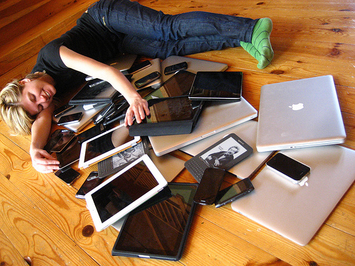
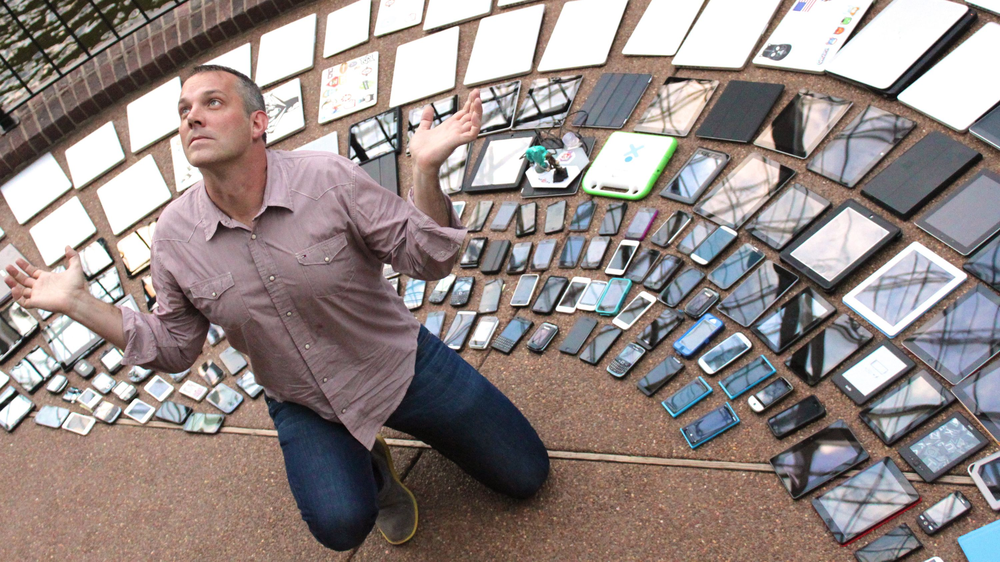
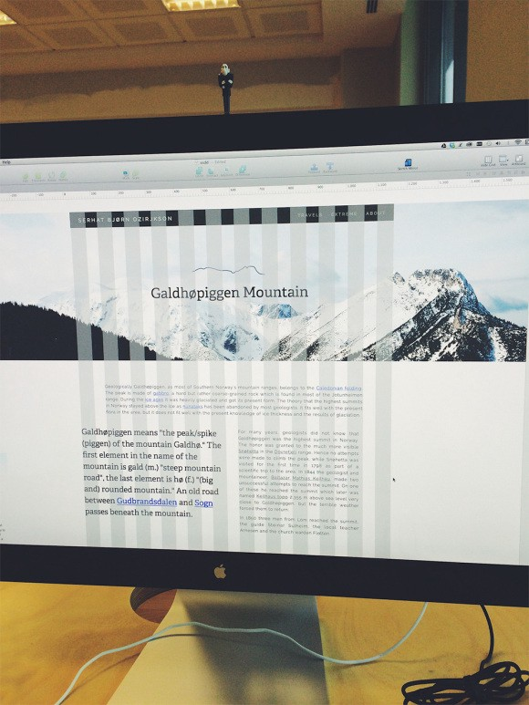
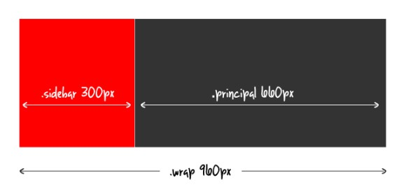
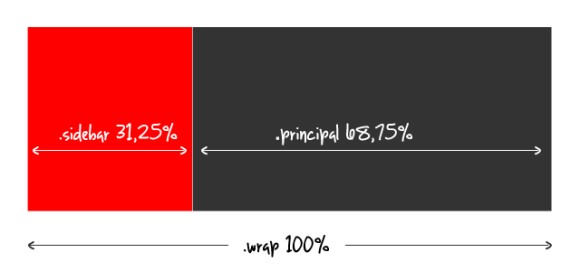

# Layout responsivo

* [Aula 1](#aula-1)
  * [O que é layout responsivo?](#o-que-é-layout-responsivo)
  * [Alguns princípios do design responsivo](#alguns-princípios-do-design-responsivo)
  * [Porque layout responsivo é 😍 ](#porque-layout-responsivo-é-)
  * [Porque layout responsivo é 🤦 ](#porque-layout-responsivo-é--1)
  * [Resolução de tela x tamanho de tela](#resolução-de-tela-x-tamanho-de-tela)
  * [Quando vale a pena ter um site com](#quando-vale-a-pena-ter-um-site-com)
  * [Técnicas de layout responsivo que vamos aprender](#técnicas-de-layout-responsivo-que-vamos-aprender)
    * [Grid fluído](#grid-fluído)
    * [Media queries](#media-queries)
  * [Breakpoints utilizados em aula](#para-facilitar-a-nossa-vida-em-aula-nós-vamos-utilizar-os-seguintes-breakpoints)
  * [Exercicio - Desktop para responsivo](https://github.com/reprograma/responsivo/tree/master/exercicio-desktop-para-responsivo)

* [Aula 2](#aula-2)
  * [Como testar](#como-testar)
  * [Font-size responsivo](#font-size-responsivo)
  * [Imagens responsivas](#imagens-responsivas)
  * [Formatos populares de arquivo de imagens para internet](#formatos-populares-de-arquivo-de-imagens-para-internet)
  * [Exercicio - Site responsivo do zero](https://github.com/reprograma/responsivo/tree/master/exercicio-responsivo-do-zero)

* [Aula 3](#aula-3)
  * [Display: flex](#display-flex)
  * [O que é mobile first](#o-que-é-mobile-first)
  * [Porque é importante](#porque-é-importante)
  * [Porque mobile first é 😍](#porque-mobile-first-é-)
  * [Porque mobile first é 🤦‍](#porque-mobile-first-é--1)

***

* [Para saber mais](#para-saber-mais)


***

## Aula 1

#### O que é layout responsivo?


Hoje em dia temos uma enorme variedade de dispositivos onde um site pode ser visualizado (laptops, tablets, netbooks, celulares, desktops com tela pequena, iMacs com telas gigantescas, televisão, etc.). Seria inviável (e enlouquecedor) desenhar uma versão específica de um site para cada tamanho e resolução de tela disponíveis no mercado.



O design responsivo é uma das soluções (design responsivo não é uma técnica, é um conceito) para nos ajudar a resolver esse problema. Um layout responsivo que é aquele que se adapta aos diversos tamanhos de telas existentes. É layout que vai se adaptar desde a tela de um celular até uma televisão de 42 polegadas.
No design responsivo o designer não apenas encolhe o conteúdo, mas adapta os elementos a fim de entregar ao usuário o melhor conteúdo e navegação para aquele cenário.

A ideia do layout responsivo surgiu em 2010, com um designer chamado Ethan Marcotte
https://alistapart.com/d/responsive-web-design/ex/ex-site-flexible.html
https://alistapart.com/article/responsive-web-design

***

#### Alguns princípios do design responsivo:

* Adaptar o layout da página de acordo com a resolução em que está sendo visualizada;
* Redimensionar as imagens automaticamente para que caibam na tela e para que não sobrecarreguem a transferência de dados em um celular, por exemplo;
* Simplificar e/ou ocultar elementos da tela para dispositivos móveis;
* Adaptar tamanho de botões e links para interfaces touch onde o ponteiro do mouse é substituído pelo dedo do usuário;
* Utilizar de forma inteligente recursos mobile como mudança na orientação do aparelho (horizontal ou vertical).

***

#### Porque layout responsivo é 😍  

* UX friendly: mantém o mesmo design adaptado para diferentes formatos de tela, sempre pensando na melhor usabilidade para cada formato;
* É mais barato desenvolver um site responsivo do que ter que desenvolver versões diferentes do site, como uma versão mobile, por exemplo;
* É mais fácil dar manutenção, porque o código está todo em um lugar só (se tivesse uma versão mobile e um app, por exemplo, uma mudança de código teria que ser feita em três lugares);
* SEO friendly: como a aplicação só tem uma URL isso ajuda a manter todos os dados consistentes e a melhorar a posição no ranking do Google.

***

#### Porque layout responsivo é 🤦‍



* Normalmente os desenvolvedores testam o site nas principais resoluções/dispositivos disponíveis no mercado, porém é possível que em alguns dispositivos com formato de tela/resoluções não tão comuns o site não renderize conforme o esperado;
* Versões antigas do IE;
* Se o layout e a arquitetura do código não forem desenhadas antes de começar o trabalho, o site pode ficar muito difícil de manter/modificar;
* O site responsivo pode ser mais demorado para carregar (se tiver muitas imagens redimensionadas, se tiver muitas chamadas externas de scripts, etc.).

***

#### Resolução de tela x tamanho de tela

Resolução de tela: A resolução da tela de um dispositivo é o número de pixels em cada dimensão que podem ser exibidos.

Tamanho de tela: tamanho físico da tela, normalmente medido em polegadas

A resolução de monitores de dispositivos digitais indica o número de pontos (ou pixels) que compõem a imagem que aparece na tela. Uma tela com 1920 x 1080 mostra 1920 pontos em cada uma das 1080 linhas do monitor, ou 2.073.600 pixeis reais.

A qualidade da definição de uma imagem ou texto que aparece na tela depende da relação entre o número de pontos por polegada quadrada (ppi, pixels per inch) com que a tela está configurada, sua resolução nativa e o tamanho físico do monitor.

Dispositivos com o mesmo tamanho podem ter resoluções de tela diferentes (Exemplo: iPhone 3 e 4)

***

#### Quando vale a pena ter um site com:

* Layout responsivo
* Versão mobile/tablet
* App (aplicativo que você baixa no seu celular)


***

#### Técnicas de layout responsivo que vamos aprender

Grid fluído + media queries

***

#### Vamos começar?

#### Grid fluído

É o uso de % ao invés de valores absolutos (px) para definir tamanhos de elementos no css.
Essa é uma técnica que pode ser usada sempre, não apenas visando os layouts responsivos.



Um dos grids mais utilizados pelos designers e programadores é o grid de 12 colunas, pela facilidade de dividir por 2, 3, 4 e 6.

Vamos usar o exemplo fixo abaixo para calcular o tamanho em % de um layout.



O cálculo que temos que sempre vamos utilizar é:

```
elemento / contexto = resultado
resultado * 100 = valor do elemento em porcentagem
```

No caso do layout acima, o cálculo seria (para o sidebar):
```
300 / 960 = 0,3125
0,3125 * 100 = 31,35
```



***

#### Media queries

São breakpoints que modificam o CSS para cada resolução de tela.
Breakpoint em programação significa uma pausa em algum momente específico determinado pelo programador. No caso de breakpoints de css, são as resoluções de tela nas quais queremos modificar o conteúdo do site.

Com as media queries e os breakpoints vamos começar a adicionar um pouco de lógica no css.
O que vai acontecer é que o browser vai ler a folha de estilos, e **SE** a condição for verdadeira, ela vai executar o bloco de código, **SENÃO** ele vai apenas ignora-lo.

***

**Importante:** Quando formos utilizar media queries, o primeiro passo é adicionar uma metatag chamada viewport no <head> do site. Essa tag vai passar instruções para o browser renderizar o conteúdo do site conforme o tamanho do dispositivo.

```html
<head>
  <meta charset="utf-8">
  <meta name="viewport" content="width=device-width, initial-scale=1">
  <link href="css/style.css" rel="stylesheet">
</head>
```

*Se [largura do dispositivo] for menor ou igual a 768px, então execute o {...}*
```css
@media (max-width: 768px) {
  .nome-da-classe {
    color: #fff; /* elemento que vai ser modificado/adicionado/sobrescrito nessa resolução */
  }
}
```


*Se [largura do dispositivo] for maior ou igual a 768px, então execute o {...}*
```css
@media (min-width: 768px) {
  .nome-da-classe {
    color: #fff; /* elemento que vai ser modificado/adicionado/sobrescrito nessa resolução */
  }
}
```

*Se [largura do dispositivo] for entre 768px e 600px, então execute o {...}*
```css
@media (max-width: 768px) and (min-width: 600px) {
  .nome-da-classe {
    color: #fff; /* elemento que vai ser modificado/adicionado/sobrescrito nessa resolução */
  }
}
```


```css
/* esse é um bloco normal de css, o browser vai ler e mostrar esses valores na tela do usuário */
.box {
  border: 1px solid #000;
  width: 320px;
  height: 120px;
  background-color: red;
}

/* esse é um bloco condicional, o browser vai ler e mostrar esses valores na tela do usuário SE a resolução da tela for menor que 768px */
@media (max-width: 768px) {
  .box {
    background-color: blue;
  }
}

/* esse é um bloco condicional, o browser vai ler e mostrar esses valores na tela do usuário SE a resolução da tela for menor que 420px */
@media (max-width: 420px) {
  .box {
    width: 100%;
    background-color: yellow;
  }
}
```


#### Para facilitar a nossa vida, em aula nós vamos utilizar os seguintes breakpoints:

```
1280px (desktop)
1024px (tablet - horizontal)
768px (tablet - vertical)
420px (mobile)
```

***

* [Exercicio - Transformar um layout feito para desktop em responsivo](https://github.com/reprograma/responsivo/tree/master/exercicio-desktop-para-responsivo)


***

## Aula 2

#### Como testar?

* [BrowserStack](https://www.browserstack.com/)
* [Google insights](https://developers.google.com/speed/pagespeed/insights/)
* [What is my screen resolution](http://whatismyscreenresolution.net/multi-screen-test)
* Chrome DevTools

***

#### Font-size responsivo

A propriedade `font-size` define o tamanho (altura) da fonte do nosso site.
Nós não conseguimos controlar o tamanho da fonte tão facilmente como controlamos outros o tamanho de outros elementos.

Exitem 2 tipos de fontes que podemos utilizar: fontes com valores fixos e valores relativos.

Valores absolutos:

* px (pixels): O valor definido em px vai ser sempre o mesmo independente da resolução/tamanho da tela.

Valores relativos:
* em: A unidade em é uma unidade relativa com base no valor computado do tamanho da fonte do elemento pai. Isso significa que os elementos filhos são sempre dependentes de seus pais para definir seu tamanho de fonte.
* rem: A unidade rem é relativa ao elemento root, ou seja, o valor da fonte definida no html ou body.


vw/vh: Valores relativos ao tamanho do viewport da tela.
1vw = 1% of viewport width
1vh = 1% of viewport height


***

#### Imagens responsivas


Imagens responsivas respondem ao tamanho da tela para escalar proporcionalmente, sem ficar pixeladas ou desproporcionais.

Uma técnica para conseguirmos ter imagens responsivas é a seguinte:

```css
.img-responsive {
  width: 100%;
  max-width: 100%;
  height: auto;
  display: block;
}
```

Criamos uma classe que podemos aplicar a todas as imagens que estão no html que queremos que fiquem responsivas. As imagens que tiverem essa classe vão ter 100% de largura com altura sempre proporcinal a altura.
O atributo `max-width: 100%;` vai assegurar que essa imagem não estique mais do que o tamanho original dela permite.

***

#### Formatos populares de arquivo de imagens para internet

* JPG ou JPEG: É um dos formatos de imagem mais populares que existem. Ele permite salvar fotos com qualidade leves porque permite compressão do arquivo. Deve ser usado para imagens do site que não precisem ser aumentadas ou que tenham grande quantidade de detalhes ou definição.

* PNG: É um formato que permite imagens com transparência e que tem a melhor qualidade. Na hora de salvar o .png também faz compressão da imagem, porém sem perder tanta qualidade quanto o .jpg. A desvantagem é que ele é um dos formatos de arquivo mais pesado.

* GIF: O .gif é um dos formatos mais populares hoje em dia. Permite salvar animações, porém com qualidade de imagem bem ruim.

* SVG: O .svg é um vetor e não uma imagem. Ele é um arquivo com instruções xml que criam um desenho vetorizado na tela. O .sg não perde qualidade e pode ser ampliado quase infinitamente. É recomendado para ícones e logotipos.


Para ajudar a salvar imagens leves e com qualidade: https://tinypng.com/

***

* [Exercicio - Codar um layout responsivo do zero](https://github.com/reprograma/responsivo/tree/master/exercicio-responsivo-do-zero)

***

## Aula 3

#### Display flexbox

A propriedade de css `display: flex` permite alinhar com facilidade elementos lado a lado.

Você deve adicionar a propriedade no elemento pai para alinhar o conteúdo filho lado a lado.


```html
<nav class="container">
  <div>Home</div>
  <div>Busca</div>
  <div>Sair</div>
</nav>
```

```css
.container {
  display: flex;
}
```

O display: flex tem propriedade complementares que permitem alinhar os elementos filhos ao centro, à direita, à esquerda, tanto na horizontal como na vertical.

`Exercício para treinar: https://flexboxfroggy.com/#pt-br`

***

#### Para saber mais:
* https://alistapart.com/article/fluidgrids (grid fluido)
* https://developer.mozilla.org/en-US/docs/Web/CSS/Media_Queries/Using_media_queries (media queries)
* http://teknosrc.com/resolution-vs-pixel-density-in-displays-all-you-need-to-know/ (resolução de tela)
* https://fueled.com/blog/iphone-screen-size-screen-resolution/ (tamanho de tela)
* https://css-tricks.com/viewport-sized-typography/
* https://www.w3schools.com/cssref/css_units.asp
* https://css-tricks.com/almanac/properties/f/font-size/
* https://developer.mozilla.org/en-US/docs/Learn/HTML/Multimedia_and_embedding/Responsive_images
* https://medium.freecodecamp.org/learn-css-flexbox-in-5-minutes-b941f0affc34
* https://flexboxfroggy.com/#pt-br
