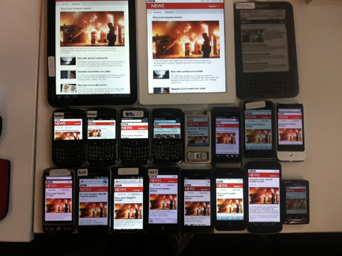
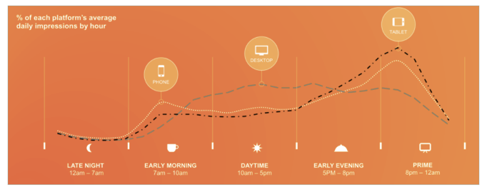
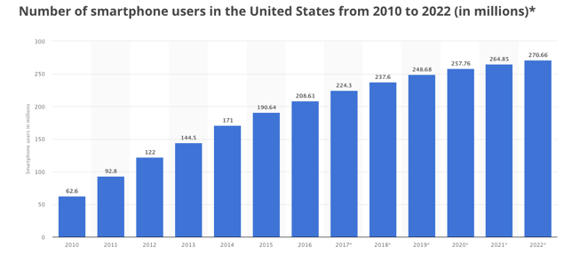

# Layout responsivo

* [Aula 1](#aula-1)
* [Aula 2](#aula-2)
* [Aula 3](#aula-3)

***

## Aula 1

#### O que é layout responsivo?


É um layout que se adapta ao diversos tamanhos de telas existentes.
Ou seja, um mesmo layout que vai se adaptar desde uma tela de celular a uma televisão de 42 polegadas.

A ideia do layout responsivo surgiu em 2010, com um designer chamado Ethan Marcotte

https://alistapart.com/d/responsive-web-design/ex/ex-site-flexible.html

https://alistapart.com/article/responsive-web-design

***

#### Porque layout responsivo é 😍  

UX friendly: mantém o mesmo design adaptado para diferentes formatos de tela, sempre pensando na melhor usabilidade para cada formato.

É mais barato desenvolver um site responsivo do que ter que desenvolver versões diferentes do site, em um versão mobile, por exemplo.

É mais fácil de manter, porque o código está em todo em um lugar só

SEO friendly: como a aplicação só tem uma URL isso ajuda a manter todos os dados consistentes e a melhorar a posição no ranking do Google

***

#### Porque layout responsivo é 🤦‍



Versões antigas do IE

Se o layout e a arquitetura do código não forem desenhadas antes de começar o trabalho, o site pode ficar muito difícil de manter/modificar

O site responsivo pode ser mais demorado de carregar (se tiver muitas imagens redimensionadas, por exemplo)

Resolução de tela x Tamanho de tela

Resolução de tela: A resolução da tela de um dispositivo é o número de pixels em cada dimensão que podem ser exibidos.

Tamanho de tela: tamanho físico da tela, normalmente medido em polegadas

Dispositivos com o mesmo tamanho podem ter resoluções de tela diferentes (Exemplo: iPhone 3 e 4)

http://teknosrc.com/resolution-vs-pixel-density-in-displays-all-you-need-to-know/

https://fueled.com/blog/iphone-screen-size-screen-resolution/

Quando vale a pena ter um site com :
Layout responsivo?
Versão mobile/tablet?
App nativo?

***

#### Técnicas de layout responsivo

1) Grid fluido: Uso de % ao invés de valores absolutos (px)
https://alistapart.com/article/fluidgrids

2) Media queries: São breakpoints que modificam o CSS para cada resolução de tela.
https://developer.mozilla.org/en-US/docs/Web/CSS/Media_Queries/Using_media_queries

***

#### Vamos começar?

O primeiro passo é adicionar a metatag viewport  no <head> do site. Essa tag vai passar instruções para o browser renderizar o conteúdo conforme o tamanho do dispositivo.


<meta name="viewport" content="width=device-width, initial-scale=1">

```
@media (max-width: 768px) {
   color: #fff;
}
```

`Se [largura do dispositivo] for menor ou igual a 768px, então execute o {...}`

```
@media (min-width: 768px) {
   color: #fff;
}
```
"Se [largura do dispositivo] for maior ou igual a 768px, então execute o {...}"

```
@media (max-width: 768px) and (min-width: 600px) {
   color: #fff;
}
```
`Se [largura do dispositivo] for entre 768px e 600px, então execute o {...}`

Apesar da grande variedade de dispositivos disponíveis no mercado, existem alguns breakpoints padrões que são mais usados:

```
1280px
1024px
768px
320px
```

***

## Aula 2

#### Como testar?

Font-size responsive

UX friendly: mantém o mesmo design adaptado para diferentes formatos de tela, sempre pensando na melhor usabilidade para cada formato.

É mais barato desenvolver um site responsivo do que ter que desenvolver versões diferentes do site, em um versão mobile, por exemplo.

É mais fácil de manter, porque o código está em todo em um lugar só

SEO friendly: como a aplicação só tem uma URL isso ajuda a manter todos os dados consistentes e a melhorar a posição no ranking do Google

Imagens responsivas

***

## Aula 3

#### Mobile first

O que é mobile first?
É exatamente o que o nome sugere: pensar em toda a estrutura de um site a partir do mobile e depois ir progressivamente pensando nas telas maiores.

***

#### Porque é importante





Apesar do número de usuários que acessam sites pelo celular/tablet, é mais comum para os designers/desenvolvedores pensar no site a partir do desktop, que é a tela que eles estão olhando quando estão trabalhando. Depois de tudo pensando para desktop, começa um processo de “aperta pra caber” o conteúdo no mobile


Só que nesse processo alguma informação importante para o usuário que acessa pelo celular pode ser cortada do site, e outras informações não tão relevantes podem ser mantidas.


Porque mobile first é 😍

* A maior vantagem desse método é a otimização do site para o celular, com foco em conteúdo e funcionalidade para melhorar a experiência do usuário


Porque mobile first é 🤦‍

* No processo de pensamento minimalista você pode acabar perdendo boas ideias
