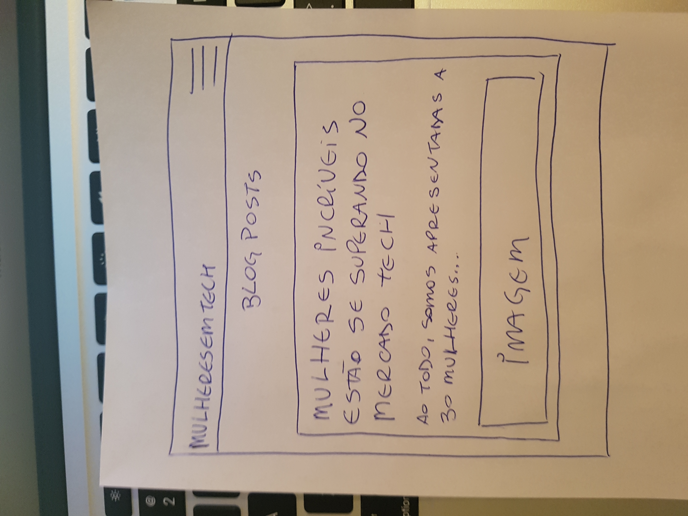
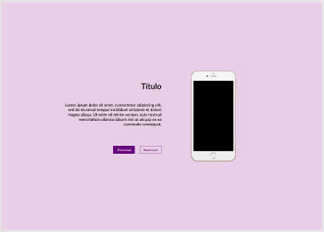
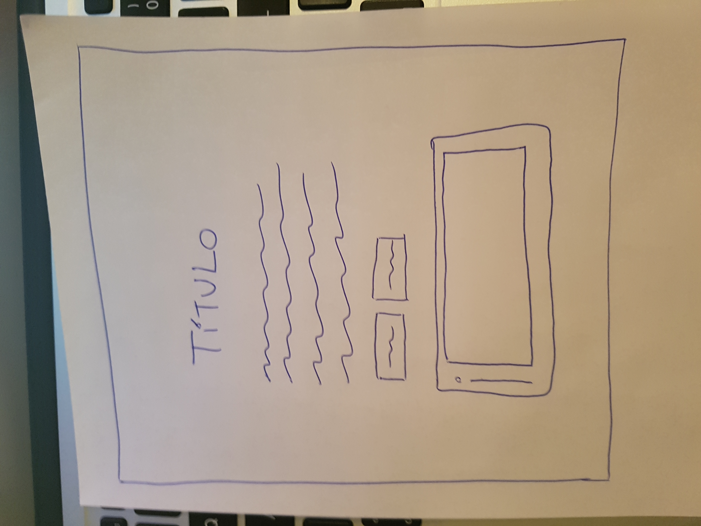

#### Exercício 1 - Transformar um layout não-responsivo para responsivo

***

**Importante:** Utilizar a metodologia [BEM](https://en.bem.info/methodology/)

***

Nosso primeiro exercício vai ser transformar alguns layouts que vocês já fizeram na semana em responsivo.

***

Breakpoints que vamos utilizar:

Desktop: 1280px

Tablet: 768px

Mobile: 420px

***

#### O layout abaixo deve ficar como no wire a partir nas resoluções =< 420px

****

#### O layout abaixo deve ficar como no wire a partir nas resoluções =< 768px

****

#### O layout abaixo deve ficar como no wire a partir nas resoluções =< 420px

